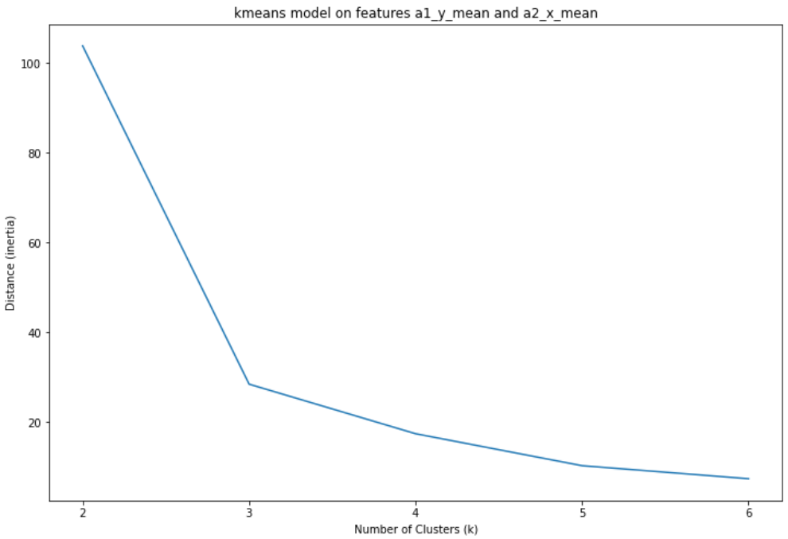
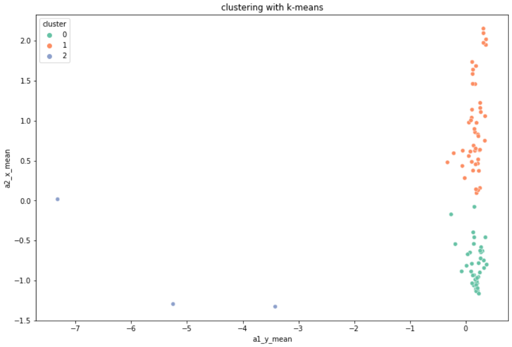
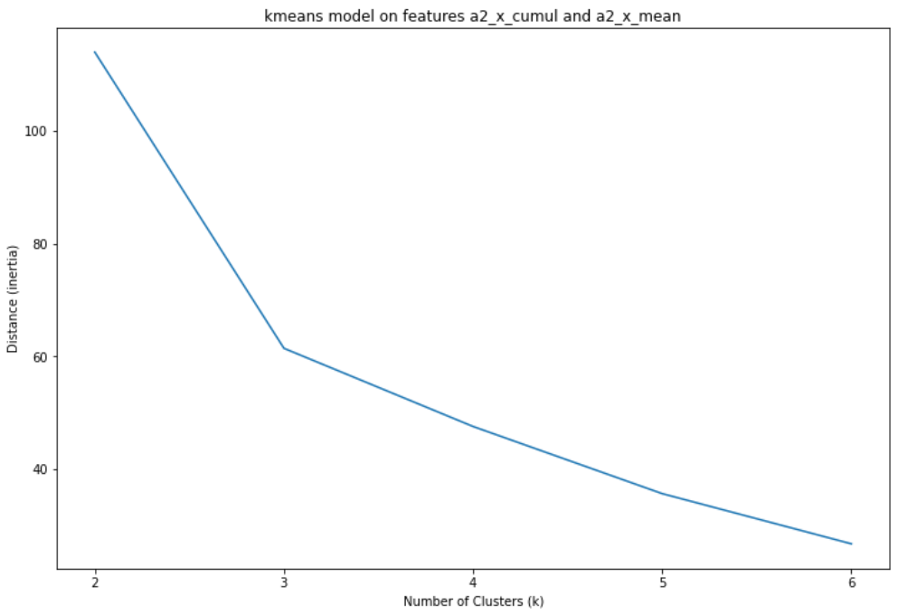
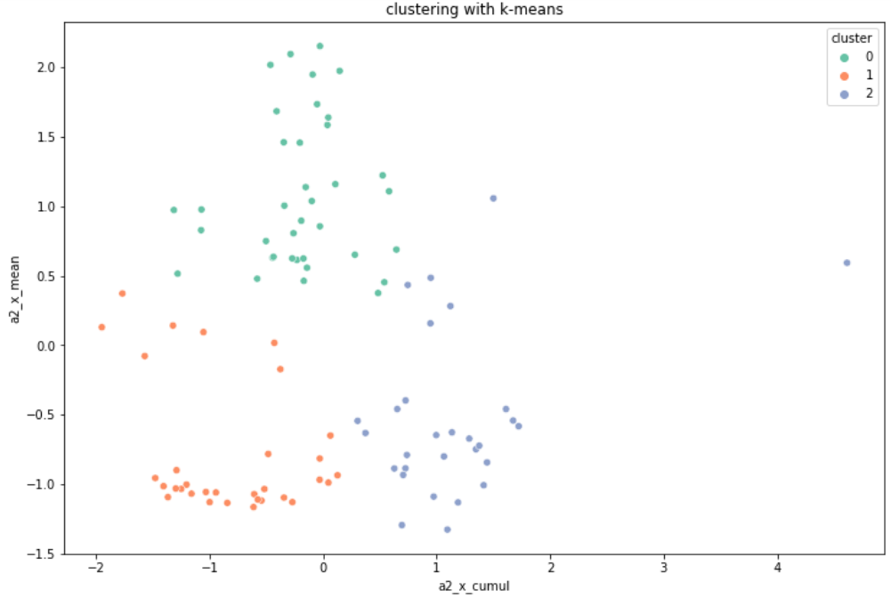
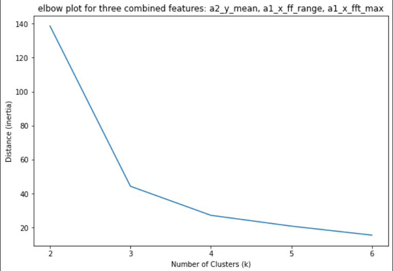
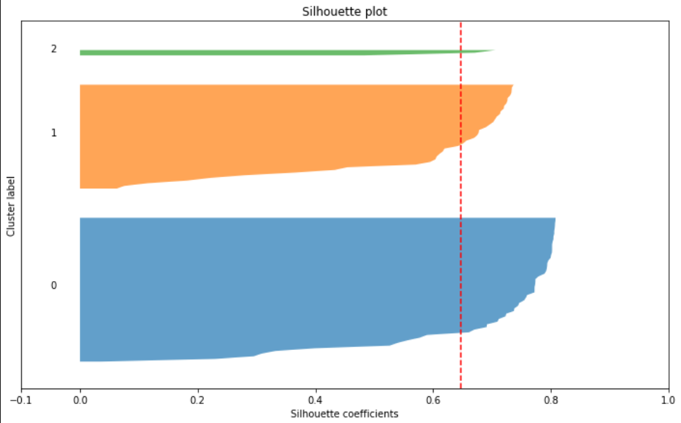
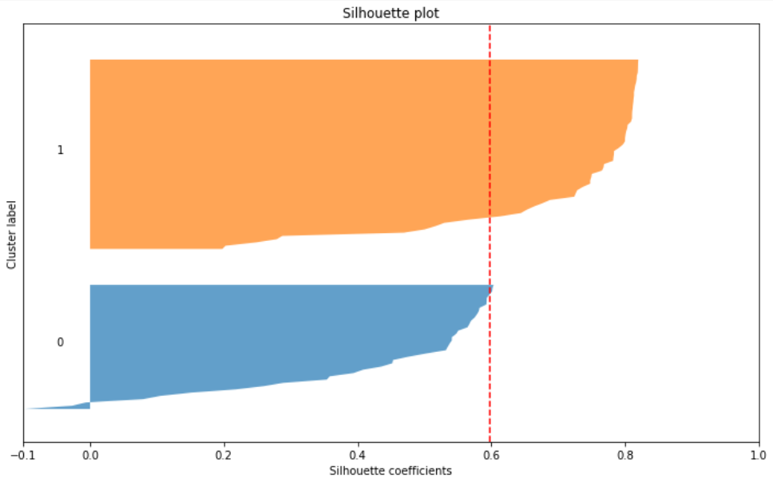
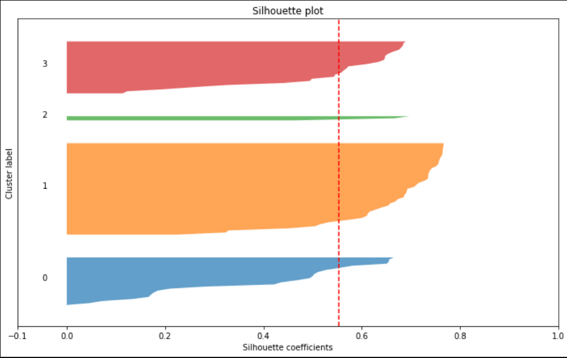

# challenge-clustering

# Description
  This was an assignment during my training at BeCode.  
  The goal was to get a feel for clustering in machine learning.
  For this we used a self-created dataframe with features extracted from a database from <a href="https://www.kaggle.com/isaienkov/bearing-classification" target="_blank">Kaggle</a>, on testing bearings.  
  Our job was to cluster the data so as to identify different types of failures of the bearings. 
  
  
# Installation
## Python version
* Python 3.9

## Databases
I made use of two databases that were created by fellow-students and/or myself in a previous project: 
* <a href="data/bearing_grouped_axes_cumulative.csv"> dataset with six features </a>
* <a href="data/bearings_final_master.csv"> dataset with 54 features </a> 

## Packages used
* pandas
* numpy
* itertools
* matplotlib.pyplot
* seaborn
* sklearn

# Usage
| File                        | Description                                                     |
|-----------------------------|-----------------------------------------------------------------|
| main.py                   | File containing Python code. The whole proces a manipulating the dataframes, investigating which features to combine and how many clusters are ideal. Also model evaluation |
| utils/data_manipulation.py | File containing Python code. Contains functions to manipulate the starting datasets so to be able to research the presence of possible clusters for failed bearings. |
| utils/plotting.py           | File containing Python code. Contains code for producing several types of plots with data from the datasets. Plots are used for exploration and evaluation. |
| csv_output                  | Folder containing some of the csv-files I used for my coding. |
| visuals                     | Folder containing plots I saved because they backed up my conclusions. |

# Which features to combine for effective clustering
## two features
This was my process to find the best two features for clustering: 
* I automated the combination of each of the present features and looked first at the combinations with the highest silhouette score for a kmeans-clustering model. 
* I visualised these combinations and finally chose a combination of features with a silhouette score as high as possible, and with a 2d-scatterplot visually showing a certain amount of clustering. 
* Finally, I plotted the numbers of clusters versus the cluster-distances, to be able to determine the suiting amount of clusters (elbow plotting). 

I have found two possible combinations: 
### features: a1_y_mean + a2_x_mean

The elbow-like shape at 3 number of clusters is indicating that I should choose that amount of clusters. 
The choice for three clusters results in the following scatterplot: 

This feature combination reaches a silhouette score of 0.74. Even though one cluster only contains a couple of datapoints, the claim could be made that those three form a cluster on themselves. Which would mean that they would be failing in another way than the bearings in the other two clusters. Their type of failure is only more rare. Of course this claim would have to be checked againts the reality. 

### features: a2_x_cumul + a2_x_mean

This time the elbow shape is not as sharp as before, but it is clearly visible. Again I concluded to take a cluster amount of three. Resulting in the following scatterplot: 

This feature combination reaches a silhouette score of 0.58

## three features
When combining three features, it is still possible to visualise a clustering (with a 3d-scatterplot). Interpretation is getting harder, so I will introduce an other tool for decision-making in clustering: silhouette plotting.

The process of finding three features combined was therefore slightly altered: 
* I automated the combination of each of the present features and looked first at the combinations with the highest silhouette score for a kmeans-clustering model.
* I visualised these combinations with a silhouette plot and finally chose a combination of features with a silhouette score as high as possible, and with a reasonable silhouette plot.
* Finally, I plotted the numbers of clusters versus the cluster-distances, to be able to determine the suiting amount of clusters (elbow plotting).

The chosen features are a2_y_mean, a1_x_ff_range, a1_x_fft_max

According to this elbow plot, the ideal number of clusters is, once again, 3. 
This choice can be backed up taking a look at some silhouette plots for this feature combination. 

Let's first look at the silhouette plot for 3 clusters: 

We can see that the average silhouette score is somewhat like 0.64. We can see that no sample has been given a negative score (which means that they are all clustered with their closest cluster). All of the clusters cross the red dotted line of the average silhouette score. Which is also a good indicator. 

Let's now compare to the silhouette plot for the same feature combination but for only 2 clusters: 

We see that some samples in cluster 0 get negative values. The average silhouette score (see the red dotted line) is also lower than the previous plot of 3 clusters. 
Therefore 2 clusters would not be a good choice. 

Compared to the silhouette plot for 4 clusters, it is more ambiguous: 

The samples in this plot seem to be well divided. Each plot crossed the average silhouette score with ease. So a choice for 4 clusters could be defended. 

Personally I would let the choice between 3 or 4 clusters be decided by the silhouette score: that score is higher with 3 clusters than with four clusters. 

Based on this analysis, I would conclude there are 3 main types of bearing failures. Two types are common, one type is more rare. 

## six features
A first glimpse at silhouette plots with six features is that is silhouette scores are not improving. Probably it will not be easy to find a good combination of six features. 

A problem with the search for a good combination of six features is that it takes a while to compute all the different feature combinations. A choice has to be made: 
* will I run all the feature combinations, in that way ensuring that I will not miss the good one, if that one exists. The downside is that it will take some time going through the results of all those combinations. 
* will I drop a certain amount of features to speed up the combination loop? The problem with that is: how do choose the features to drop? There is randomness in play there. 

In the main.py file a first attempt at investigating six features is done. Unfortunately this is still a work in progress.  

# The bearings test

# Links 
I made use of dataframes created in two other projects: 

* <a href="https://github.com/ltadrummond/challenge-clustering" target="_blank"> project from collegues </a> that extracted a dataframe with 54 features extracted from the original bearing dataset
* <a href="https://github.com/Roldan87/challenge-classification" target="_blank"> project from our group </a> that extracted a dataframe with 6 features extracted from the original bearing dataset

# Contributor
| Name                  | Github                                 |
|-----------------------|----------------------------------------|
| Maarten Van den Bulcke           | https://github.com/MaartenVdBulcke       |

# Timeline
09/08/2021 - 11/08/2021
