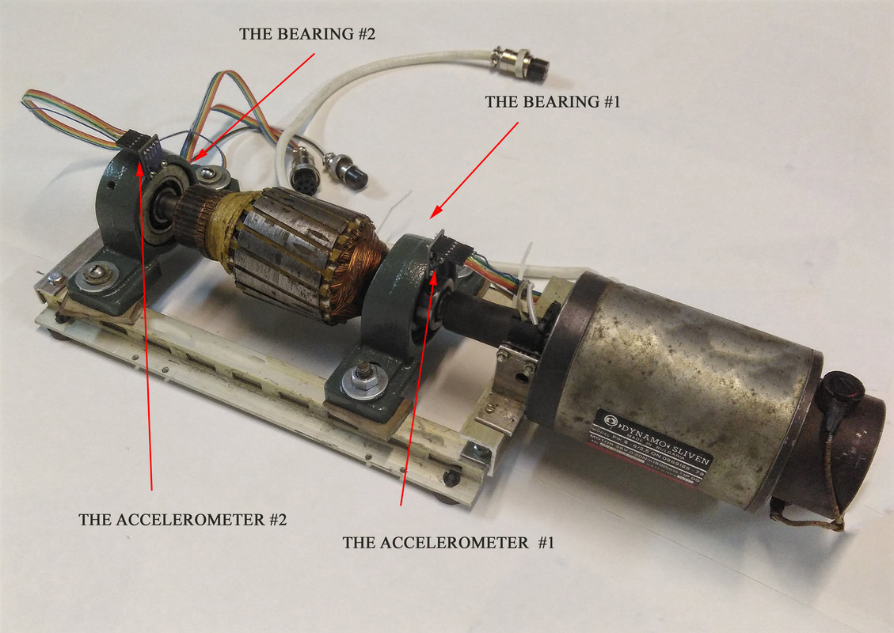

# challenge-clustering

# Description
  This was an assignment during my training at BeCode.  
  The goal was to get a feel for clustering in machine learning.
  For this we used a self-created dataframe with features extracted from a database from <a href="https://www.kaggle.com/isaienkov/bearing-classification" target="_blank">Kaggle</a>, on testing bearings.  
  Our job was to cluster the data so as to identify different types of failures of the bearings. 
  
  
# Installation
## Python version
* Python 3.9

## Databases
I made use of two databases that were created by fellow-students and/or myself in a previous project: 
* <a href "data/bearing_grouped_axes_cumulative.csv"> dataset with six features </a>
* <a href "data/bearings_final_master.csv"> dataset with 54 features </a> 

## Packages used
* pandas
* numpy
* itertools
* matplotlib.pyplot
* seaborn
* sklearn

# Usage
| File                        | Description                                                     |
|-----------------------------|-----------------------------------------------------------------|
| main.py                   | File containing Python code. The whole proces a manipulating the dataframes, investigating which features to combine and how many clusters are ideal. Also model evaluation |
| utils/data_manipulation.py | File containing Python code. Contains functions to manipulate the starting datasets so to be able to research the presence of possible clusters for failed bearings. |
| utils/plotting.py           | File containing Python code. Contains code for producing several types of plots with data from the datasets. Plots are used for exploration and evaluation. |
| csv_output                  | Folder containing some of the csv-files I used for my coding. |
| visuals                     | Folder containing plots I saved because they backed up my conclusions. |

# Which features to combine for effective clustering
## two features
This was my proces to find the best two features for clustering: 
* I automated the combination of each of the present features and looked first at the combinations with the highest silhouette score for a kmeans-clustering model. 
* I visualised these combinations and finally chose a combination of features with a silhouette score as high as possible, and with a 2d-scatterplot visually showing a certain amount of clustering. 
* Finally, I plotted the numbers of clusters versus the cluster-distances, to be able to determine the suiting amount of clusters. 

I have found two possible combinations: 
### features: a1_y_mean + a2_x_mean

### features: a2_x_cumul + a2_x_mean

| Column name of feature | Change made                  | Reason                                                                                        |
|------------------------|------------------------------|-----------------------------------------------------------------------------------------------|
| timestamp              | Only keeping rows above 0,25 | We found some outliers where the "rpm" and "hz" values spiked in the first parts of the test.   With the use of plotting, we discovered a cut off point. |

### How many clusters

## three features
### How many clusters

## six features
### How many clusters

# Extra visuals

## The bearings test

## Plot showing the min-max-difference of every axis, on every bearing.

## Plot that gave us the idea to look into the first seconds.

## Plot that showed possible clusters
Ready for future exploration

# Links 
I made use of dataframes created in two other projects: 

* <a href="https://github.com/ltadrummond/challenge-clustering" target="_blank"> project from collegues </a> that extracted a dataframe with 54 features extracted from the original bearing dataset
* <a href="https://github.com/Roldan87/challenge-classification" target="_blank"> project from our group </a> that extracted a dataframe with 6 features extracted from the original bearing dataset

# Contributor
| Name                  | Github                                 |
|-----------------------|----------------------------------------|
| Maarten Van den Bulcke           | https://github.com/MaartenVdBulcke       |

# Timeline
09/08/2021 - 11/08/2021
